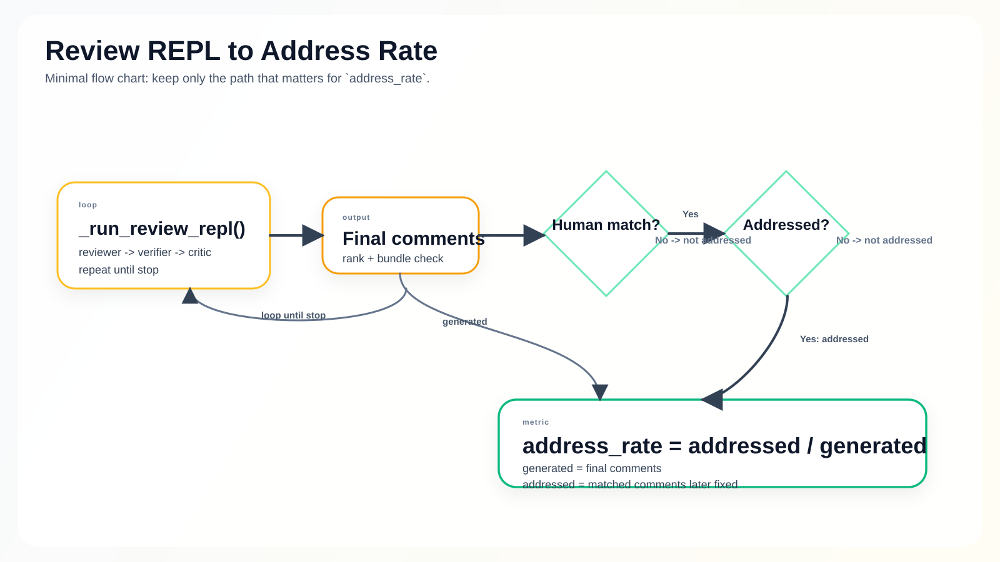

# ARES

ARES is an agentic AI code review pipeline designed and implemented by **Dev Desai**.

This project explores a simple question with real engineering consequences:

> Can we build an AI reviewer that produces comments developers would actually act on, instead of generating generic feedback that gets ignored?

My answer in this repository is a verification-first review system that does more than label code as risky. ARES gathers repository context, reasons over changed code, generates candidate findings, synthesizes fixes and regression tests, scores the usefulness of those findings, and only keeps the comments that survive a multi-stage quality gate.

Unlike many "AI reviewer" demos that stop at prompt engineering, this project treats code review as a systems problem. The pipeline combines graph-aware context retrieval, structured LLM reasoning, static analysis, verification, ranking, and feedback learning into a single orchestrated workflow aimed at one business outcome: **high-signal comments that are plausible, actionable, and worth a developer's time.**

---

## Author

**Dev Desai**

This repository was built as a research-oriented engineering project to demonstrate:

- end-to-end applied AI systems design
- production-style Python architecture
- evaluation-driven iteration
- integration with developer infrastructure such as GitHub, Neo4j, Pinecone, and local test runners
- the ability to translate current research ideas into an executable, inspectable product prototype

---

## Executive Summary

ARES reviews a pull request by combining source code structure, repository history, static analysis, and LLM-based reasoning. The pipeline does not trust first-pass model output. Instead, it runs candidate comments through a staged loop:

1. Identify the most important changed code regions.
2. Gather structural and semantic context around those regions.
3. Generate review comments with explicit evidence and impact.
4. Filter out weak or speculative comments.
5. Attempt to verify comments by synthesizing fixes and tests.
6. Score and rank the surviving comments.
7. Learn from historical outcomes so future reviews improve.

The result is a system designed to optimize for **developer usefulness**, not just raw generation volume.

---

## Problem Statement

Most AI-generated code review comments fail for predictable reasons:

- they are too vague to be actionable
- they point out stylistic issues instead of real defects
- they ignore repository-specific context
- they lack evidence
- they overfit to the changed lines and miss downstream impact
- they are never validated before being surfaced to engineers

That creates a trust problem. If an AI reviewer produces many low-value comments, developers quickly learn to ignore it.

ARES is built around the opposite philosophy:

**fewer comments, stronger comments, and verifiable comments.**

---

## Project Hypothesis

The central hypothesis behind this repository is:

> AI code review quality improves materially when candidate comments are grounded in repository structure, forced into an evidence-based reasoning format, and filtered through verification before ranking.

This breaks down into four smaller hypotheses:

- **Context hypothesis**: graph-aware code context leads to better target selection than reviewing changed files in isolation.
- **Prompting hypothesis**: structured prompting reduces speculative and low-confidence review comments.
- **Verification hypothesis**: attempting fix synthesis and regression testing removes a meaningful fraction of weak comments before they reach the developer.
- **Feedback hypothesis**: historical review outcomes can guide future comment generation and ranking through retrieval and scoring.

This repository exists to test those ideas in a form that is inspectable, reproducible, and extensible.

---

## Results

The current README-reported evaluation results are:

| Metric | Value |
|--------|-------|
| Address Rate | 58.3% |
| Precision | 58.3% |
| Plausible Rate | 41.7% |
| Verified Rate | 100% |
| Cost per PR | ~ $0.20 |

Interpretation:

- **Address Rate**: the share of generated comments that aligned with issues human reviewers also raised and that were later fixed by developers.
- **Precision**: the share of generated comments that matched human review comments.
- **Plausible Rate**: novel comments on changed code that did not match human comments but still appear grounded in the diff.
- **Verified Rate**: the share of posted comments that survived the verification stage.

These numbers matter because they emphasize practical review quality rather than model eloquence. A strong AI reviewer is not just fluent; it is useful.

---

## Why This Project Is Interesting

This repository is not a thin wrapper around an LLM API. It demonstrates several engineering themes that are especially relevant for applied AI and platform roles:

- **Multi-agent orchestration** across reviewer, verifier, critic, and investigator roles
- **Hybrid retrieval** using both structural graph context and historical feedback embeddings
- **Evaluation-first thinking** with measurable quality targets
- **Verification loops** that reduce hallucinated or weak findings
- **Developer tooling integration** with GitHub, static analyzers, and test execution
- **System decomposition** into well-separated modules that can evolve independently

For a hiring manager, the important signal here is not only that the system works, but that it was designed with clear tradeoffs, measurable outcomes, and extensible architecture.

---

## System Architecture

ARES is composed of five major layers:

1. **Ingestion and repository preparation**
2. **Code understanding and graph context**
3. **Candidate generation and verification**
4. **Scoring, ranking, and posting**
5. **Feedback collection and learning**

### High-Level Flow

```text
GitHub PR
  -> clone changed revision
  -> load or patch repository graph
  -> analyze changed nodes and files
  -> generate review targets
  -> produce candidate comments
  -> verify candidates with code/test checks
  -> score and rank survivors
  -> post final review comments
  -> collect outcomes for future learning
```

### Architecture Diagram



### Architectural Rationale

The system intentionally separates **generation** from **validation**.

- The **Reviewer** is optimized for rich reasoning and comment generation.
- The **Verifier** is optimized for checking whether a comment corresponds to something testable or mechanically defensible.
- The **Critic** is optimized for usefulness scoring and historical-pattern filtering.
- The **Investigator** is optimized for deciding where the model should spend its attention.

This separation is important. In practice, many AI systems fail because one model is expected to do everything at once. ARES decomposes the workflow so each stage has a narrower responsibility and better failure containment.

---

## Detailed Pipeline Walkthrough

### 1. GitHub Intake

The pipeline starts with a pull request and collects:

- title and description
- changed files
- diff hunks
- commit messages
- branch and checkout metadata
- review-ground-truth data for evaluation

This lives primarily in [ares/integrations/github_client.py](/Users/DEVDESAI1/Desktop/University_at_Buffalo/Projects/Pair_programer2/ares/integrations/github_client.py).

### 2. Repository Graph Build or Load

The system either loads an existing code graph or builds one from the repository. The graph tracks structural program information and repository-aware metadata used later for investigation and prioritization.

Core modules:

- [ares/graph/parser.py](/Users/DEVDESAI1/Desktop/University_at_Buffalo/Projects/Pair_programer2/ares/graph/parser.py)
- [ares/graph/indexer.py](/Users/DEVDESAI1/Desktop/University_at_Buffalo/Projects/Pair_programer2/ares/graph/indexer.py)
- [ares/graph/query.py](/Users/DEVDESAI1/Desktop/University_at_Buffalo/Projects/Pair_programer2/ares/graph/query.py)
- [ares/integrations/neo4j_client.py](/Users/DEVDESAI1/Desktop/University_at_Buffalo/Projects/Pair_programer2/ares/integrations/neo4j_client.py)

### 3. Review Scope Selection

Not every changed file deserves the same scrutiny. ARES narrows the reviewable surface using:

- changed source files
- diff ranges
- graph node mapping
- maintenance-only heuristics
- static analysis results

This reduces wasted model tokens and improves precision by focusing attention on code with higher bug potential.

Relevant modules:

- [ares/review_scope.py](/Users/DEVDESAI1/Desktop/University_at_Buffalo/Projects/Pair_programer2/ares/review_scope.py)
- [ares/static_analysis/runner.py](/Users/DEVDESAI1/Desktop/University_at_Buffalo/Projects/Pair_programer2/ares/static_analysis/runner.py)

### 4. Investigation and Context Assembly

The Investigator determines which code regions are worth reviewing and what context the model should receive. This includes:

- caller and callee context
- blast-radius hints
- changed-node metadata
- diff hunk alignment
- PR intent cues from title, description, and commits

Relevant module:

- [ares/agents/investigator.py](/Users/DEVDESAI1/Desktop/University_at_Buffalo/Projects/Pair_programer2/ares/agents/investigator.py)

### 5. Structured Comment Generation

The Reviewer generates candidate comments using structured prompting rather than loose free-form critique. The goal is to anchor each comment in:

- premise
- evidence
- trigger
- impact

This is one of the strongest design choices in the repository because it pushes the model toward defensible, reviewer-like reasoning instead of generic suggestions.

Relevant module:

- [ares/agents/reviewer.py](/Users/DEVDESAI1/Desktop/University_at_Buffalo/Projects/Pair_programer2/ares/agents/reviewer.py)

### 6. Verification

This is the differentiator.

The Verifier attempts to make a candidate comment earn its place by:

- synthesizing a minimal fix
- checking whether the diff is meaningful
- compiling or validating the proposed change when possible
- generating a regression test
- running the test to see whether the issue is reproducible and catchable

Relevant module:

- [ares/agents/verifier.py](/Users/DEVDESAI1/Desktop/University_at_Buffalo/Projects/Pair_programer2/ares/agents/verifier.py)

### 7. Critique, Ranking, and Final Selection

After verification, the system scores surviving comments with heuristics, model judgment, and historical feedback signals. It then deduplicates and caps the final set.

Relevant modules:

- [ares/agents/critic.py](/Users/DEVDESAI1/Desktop/University_at_Buffalo/Projects/Pair_programer2/ares/agents/critic.py)
- [ares/ranker/ranker.py](/Users/DEVDESAI1/Desktop/University_at_Buffalo/Projects/Pair_programer2/ares/ranker/ranker.py)

### 8. Feedback Loop

The long-term ambition is not just to review code once, but to improve over time. The feedback layer records outcomes and adapts review strategy based on what developers actually responded to.

Relevant modules:

- [ares/feedback/collector.py](/Users/DEVDESAI1/Desktop/University_at_Buffalo/Projects/Pair_programer2/ares/feedback/collector.py)
- [ares/feedback/learner.py](/Users/DEVDESAI1/Desktop/University_at_Buffalo/Projects/Pair_programer2/ares/feedback/learner.py)
- [ares/feedback/strategy.py](/Users/DEVDESAI1/Desktop/University_at_Buffalo/Projects/Pair_programer2/ares/feedback/strategy.py)

---

## Design Principles

Several principles shaped the implementation:

### Verification Over Confidence

A confident comment is not automatically a correct or useful comment. ARES prefers evidence and checks over stylistic confidence.

### Fewer, Better Comments

Developer trust is easier to lose than regain. The system is designed to cap output and keep only the strongest findings.

### Context Before Generation

Better targeting and retrieval improve downstream model behavior more reliably than simply increasing prompt size.

### Evaluation as a First-Class Feature

The project includes evaluation and sampling tooling because quality claims should be measurable, not rhetorical.

### Explicit Modularity

The separation between graph, agents, integrations, ranking, and feedback makes the system easier to reason about and extend.

---

## Repository Structure

```text
ares/
  agents/
    _llm.py
    critic.py
    investigator.py
    reviewer.py
    verifier.py
  feedback/
    collector.py
    learner.py
    strategy.py
  graph/
    classifier.py
    indexer.py
    parser.py
    query.py
  integrations/
    github_client.py
    neo4j_client.py
    pinecone_client.py
  ranker/
    ranker.py
  static_analysis/
    runner.py
  config.py
  evaluate.py
  pipeline.py
  review_scope.py
  utils/
    json_utils.py
    text_similarity.py
scripts/
  build_graph.py
  eval_comment_sample.py
  seed_pinecone.py
tests/
  ...
docs/
  current-architecture-simple.svg
```

### Core Entry Point

The main orchestration logic lives in [ares/pipeline.py](/Users/DEVDESAI1/Desktop/University_at_Buffalo/Projects/Pair_programer2/ares/pipeline.py). This is where graph loading, investigation, review generation, verification, ranking, evaluation hooks, and feedback collection come together.

---

## Evaluation Methodology

This repository does not treat evaluation as an afterthought.

The evaluation harness in [scripts/eval_comment_sample.py](/Users/DEVDESAI1/Desktop/University_at_Buffalo/Projects/Pair_programer2/scripts/eval_comment_sample.py) samples pull requests and measures generated comments against human review activity.

### Metrics Used

- **Address Rate**: generated comments that matched issues humans also identified and that were later fixed
- **Precision**: generated comments that aligned with human review comments
- **Plausible Rate**: generated comments grounded in changed code but not matched to human comments
- **Verified Rate**: generated comments backed by the verification stage

### Why These Metrics Matter

These metrics are closer to engineering usefulness than surface-level language metrics. They ask whether the system is producing comments that are:

- relevant
- grounded
- acted upon
- validated

That framing is critical if the goal is to build developer trust.

---

## Tooling and Infrastructure

ARES integrates several external systems:

- **GitHub** for pull request data, cloning, comments, and ground-truth review collection
- **Neo4j** for code graph persistence and structural querying
- **Pinecone** for storing and retrieving historical feedback signals
- **Static analyzers** such as Ruff and Semgrep for non-LLM findings and supporting signals
- **LLM providers** through a shared adapter layer

This mix shows the project is not just an ML exercise; it is an engineering system that sits inside a realistic developer workflow.

---

## Quick Start

### 1. Create a virtual environment

```bash
python -m venv .venv
source .venv/bin/activate
pip install -r requirements.txt
```

### 2. Set environment variables

```bash
export ANTHROPIC_API_KEY="sk-ant-..."
export GITHUB_TOKEN="ghp_..."
export PINECONE_API_KEY="pcsk_..."
export NEO4J_URI="neo4j+s://xxxxx.databases.neo4j.io"
export NEO4J_USERNAME="neo4j"
export NEO4J_PASSWORD="..."
```

### 3. Build the code graph

```bash
python scripts/build_graph.py --repo fastapi/fastapi --branch master --clone-depth 100
```

### 4. Seed historical feedback

```bash
python scripts/seed_pinecone.py --repo fastapi/fastapi --max-prs 200
```

### 5. Run evaluation

```bash
python scripts/eval_comment_sample.py \
  --repo fastapi/fastapi \
  --target-comments 50 \
  --max-inspected-prs 200 \
  --min-human-comments 1 \
  --base-branch master
```

---

## Configuration

Configuration is environment-driven.

| Variable | Default | Description |
|----------|---------|-------------|
| `ARES_MODEL` | `claude-sonnet-4-6` | Primary reviewer model |
| `ARES_LIGHTWEIGHT_MODEL` | `claude-haiku-4-5-20251001` | Verification and critique model |
| `ARES_MAX_COMMENTS` | `3` | Maximum final comments per PR |
| `ARES_REVIEW_MAX_PASSES` | `1` | Review refinement passes |
| `ARES_REVIEW_AGGREGATION_RUNS` | `1` | Independent review runs for aggregation |
| `ARES_ACTIONABILITY_FILTER` | `1` | Enable actionability filtering |
| `ARES_PINECONE_INDEX` | `ares-comments` | Pinecone index |
| `ARES_PINECONE_NAMESPACE` | `default` | Pinecone namespace |

---

## Research and Inspiration

This project is informed by several visible trends in modern AI engineering:

- structured reasoning for higher-quality code understanding
- verifier-style loops instead of one-shot generation
- retrieval-informed generation grounded in repository context
- evaluation against real human review signals
- feedback-aware ranking and continuous improvement

The exact implementation here is my own, but the direction is aligned with the broader evolution of agentic software engineering systems.

---

## What I Would Build Next

If I were extending this project further, the highest-leverage next steps would be:

- richer graph schemas for data flow and type-aware reasoning
- stronger verifier sandboxes for broader language support
- offline ablation studies for each stage of the pipeline
- reviewer personalization based on repository norms
- UI and analytics for reviewer trust, comment acceptance, and failure analysis
- benchmark packaging for repeatable side-by-side comparisons

These are deliberate next steps, not generic roadmap filler. They follow naturally from the architecture already in place.

---

## Why This Is a Strong Hiring Signal

For a hiring manager, this project demonstrates that I can:

- identify an important real-world problem
- frame it with a measurable hypothesis
- design a modular architecture
- integrate external systems into a cohesive workflow
- build evaluation around the system instead of around a demo
- communicate technical intent clearly

In other words, this repository is not only a code sample. It is evidence of product-minded engineering, systems thinking, and applied AI execution.

---

## Closing Note

ARES represents the kind of engineering work I enjoy most: turning ambiguous AI potential into a concrete, testable, technically disciplined system.

If you are reading this as a reviewer, recruiter, or hiring manager, the main takeaway is simple:

**this project was built to show depth, not just output.**
